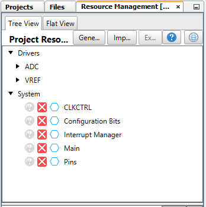
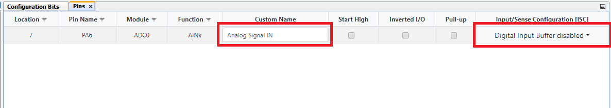
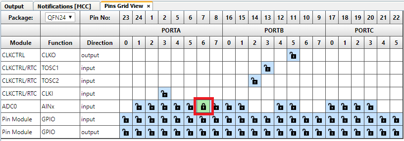
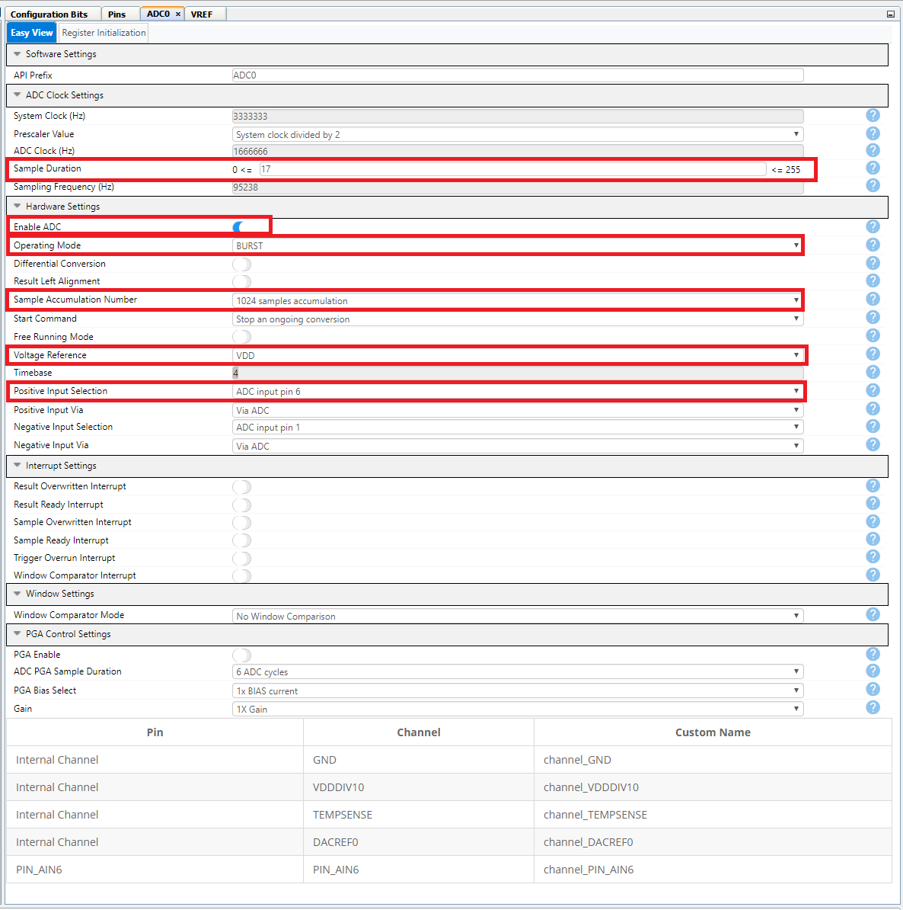
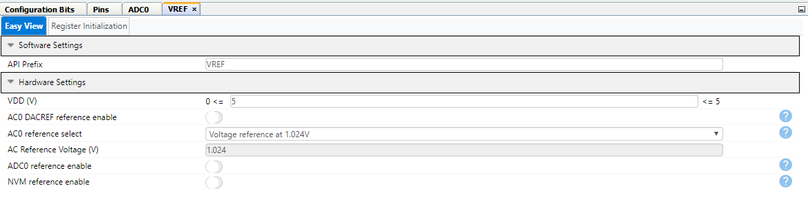
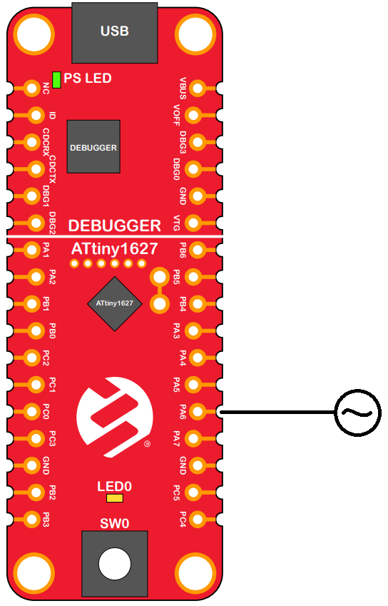

# How to Use the 12-Bit Differential ADC with PGA in Burst Accumulation Mode

This code example shows how to use oversampling to increase resolution from 12 to 17 bits. The ADC samples the signal as fast as possible, and the samples are automatically accumulated into the result register when 1024 samples have been converted.

## Related Documentation
* [TB3254 - How to Use the 12-Bit Differential ADC with PGA in Burst Accumulation Mode](https://microchip.com/DS90003254)
* Data Sheets available on Product Pages:
  * [ATtiny1624](https://microchip.com/wwwproducts/en/ATtiny1624)
  * [ATtiny1626](https://microchip.com/wwwproducts/en/ATtiny1626)
  * [ATtiny1627](https://microchip.com/wwwproducts/en/ATtiny1627)

## Software Used

* [MPLAB® X](https://www.microchip.com/mplab/mplab-x-ide) v5.45 or later
* [MPLAB® XC8 Compiler](https://www.microchip.com/mplab/compilers) v2.31 or later
* [MPLAB® Code Configurator (MCC)](https://www.microchip.com/mplab/mplab-code-configurator) 4.1.0 or newer 
* [MPLAB® Melody Library](https://www.microchip.com/mplab/mplab-code-configurator) 1.37.17 or newer 
* [Microchip ATtiny Series Device Support](https://packs.download.microchip.com/) 2.6.122 or newer

## Hardware Used

* [ATtiny1627 Curiosity Nano](https://www.microchip.com/DevelopmentTools/ProductDetails/PartNO/DM080104)

## Peripherals Configuration using MCC
### Added Peripherals

### Pin manager

### Aanalog to Digital Converter

### Voltage Reference
This peripheral is ofen used with the ADC, and such is included but not configured, as the example uses VDD as referance.

## Setup
* Connect an analog signal to PA6.

## Operation
* Connect the ATtiny1627 Curiosity Nano to a computer using a USB cable
* Download the *.zip file or clone the example to get the source code
* Open the `*.X` project you want to test in MPLAB X
* Press the `make and program` button to program the device
* If no tool has been chosen, a window will open, select the AVR128DB48 Curiosity Nano. The tool can also be choosen in the project settings.
* Connect an analog signal to PA6. The signal must range between GND and VDD. To see the 17-bit result, place a breakpoint in the `while(1)` loop in the `main()` function and use a debugger to start a debug session. When the device is halted, the variables that are interesting may be placed in the watch list to see their values.

## Summary

After going through this example you should have a better understanding of how to use the tinyAVR 2-series ADC in Burst mode with Oversampling.